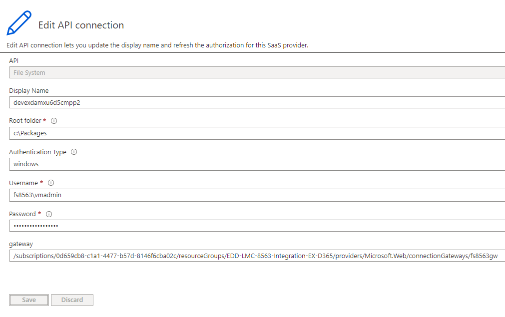
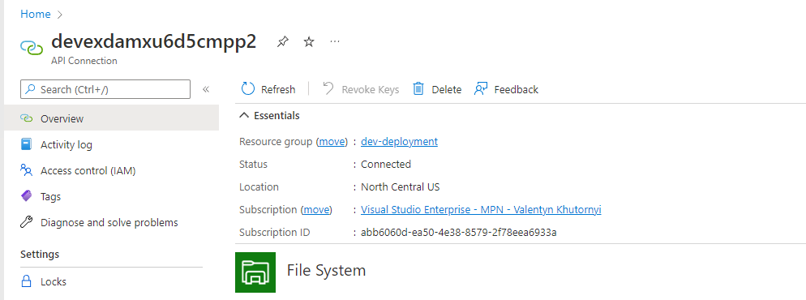
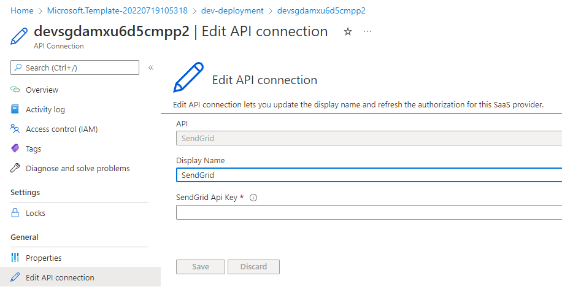
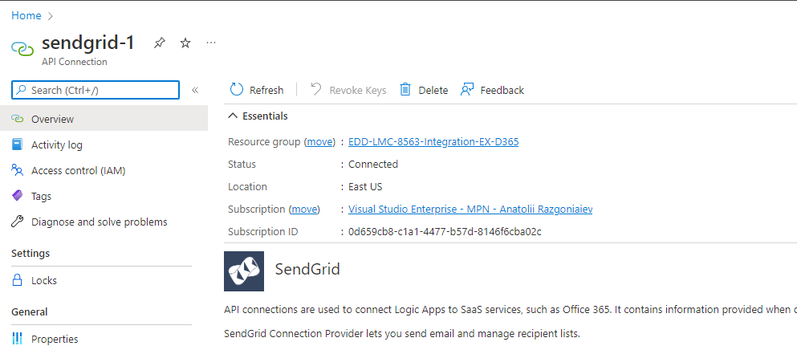

# How to install ARM template

##Prerequisites
- You must have installed and configured Twilio SendGrid in your Azure Subscription to be able to receive email alerts from Logic Apps.
- You must have installed and configured an On-premises data gateway for your onpremise external system

#  MAIN solution

#  EX system connectors

# Post deployment tasks
- Find external system deployed web connector and fill out all requred fields
 

- Make sure the status is changes to "connected"

- Find sendgrid deployed web connector and fill out the API Key field
 

- Make sure the status is changes to "connected"
